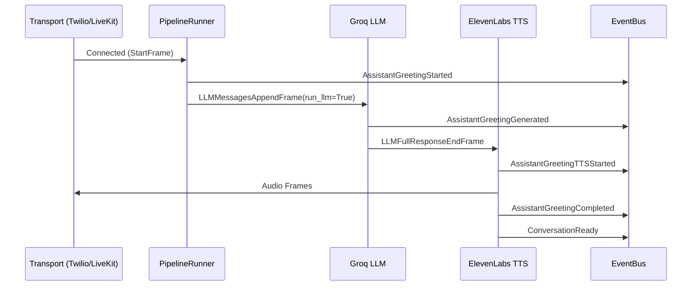

# Conversation Bootstrap Overview

## Introduction
The Assistant-Initiated Conversation Bootstrap functionality guarantees that the voice assistant speaks first upon a successful connection (Twilio WebSocket or LiveKit Room). This creates a more natural user experience by proactively guiding the user into the conversation, rather than waiting in silence for the user to speak first.

## Triggering Mechanism
The Pipecat event bridge was extended to listen for the `StartFrame`, which propagates through the pipeline immediately upon connection. If the environment variable `ENABLE_INITIAL_GREETING` is true (default), the assistant will dynamically inject an `LLMMessagesAppendFrame` with an internal, hidden prompt into the LLM context. 

## Hidden Prompt
The prompt used is:
> A new phone conversation has just started. Generate a short, friendly greeting. Maximum: two short sentences. Invite the caller to speak. Do not introduce yourself repeatedly. Do not mention you are an AI unless asked.

## Latency and STT Management
To avoid echo and self-transcription, `DeepgramSTTService` processing is suppressed while the initial greeting plays out. We configured `MuteUntilFirstBotCompleteUserMuteStrategy` in the `LLMUserAggregatorParams`. This mutes the user VAD input natively until `SpeakingFinished` is fired on the very first turn. 

## Flow Execution

